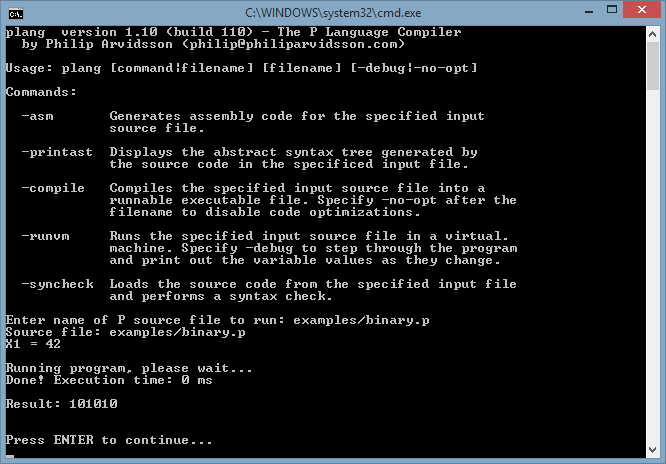

## What is the P (SUCC / PRED) programming language and plang?

P (also known as *the Simple Programming Language*) is a theoretical, trivial programming language—based on the
Unbounded Register Machine of Shepherdson and Sturgis (JACM 10, 1963)—usually introduced to the students during the introductory undergraduate courses in computer science. Although the language is extremely simple, it is still [Turing complete](https://en.wikipedia.org/wiki/Turing_completeness), which means that anything calculable *can* be calculated with a P program.

The **plang** compiler was a pastime project of mine when I wanted to learn how to build a compiler from scratch to understand the intricacies of programming language parsing (i.e. lexing, parsing, AST optimization and code generation) better as well as provide a simpler way of testing and debugging algorithms written in P (as part of school assignments). You may use plang to test your algorithms written in P or, if you're interested in developing your own compiler or programming language, use the compiler source code as a source inspiration and way of reasoning about the problem.

Unfortunately, the documentation and source comments are entirely in Swedish. Interested in a translation? Drop me a message!

*Don't forget to take a look at the examples! Anything calculable can be done in P since it's Turing complete - a good (and somewhat amazing!) example of this is the [cosine calculator](plang/examples/cos.p) (using [Taylor series](https://en.wikipedia.org/wiki/Taylor_series)).*

**Features:**

* Syntax error checking
* Abstract syntax tree generation
* Virtual machine for running and debugging P programs—stepping through the source code a single line at a time
* Assembly x86 code generation
* Compilation to stand-alone Windows PE-format executables (run your P programs natively!)

